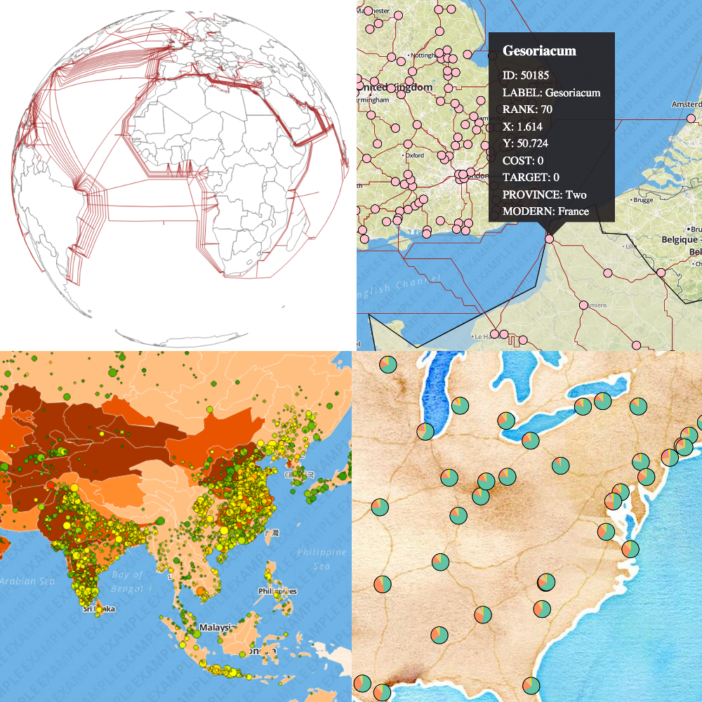

d3-carto-map
======

0.4

**d3.carto** is a library for creating layer-based maps using D3. It allows you to easily make tile and vector maps that take advantage of D3's amazing geospatial functionality.

Take a look at [the wiki](https://github.com/emeeks/d3-carto-map/wiki) to get started or if you'd prefer to see what d3.carto can do, [there are some examples here](https://github.com/emeeks/d3-carto-map/wiki/Examples) and more as [blocks](http://bl.ocks.org/emeeks).

